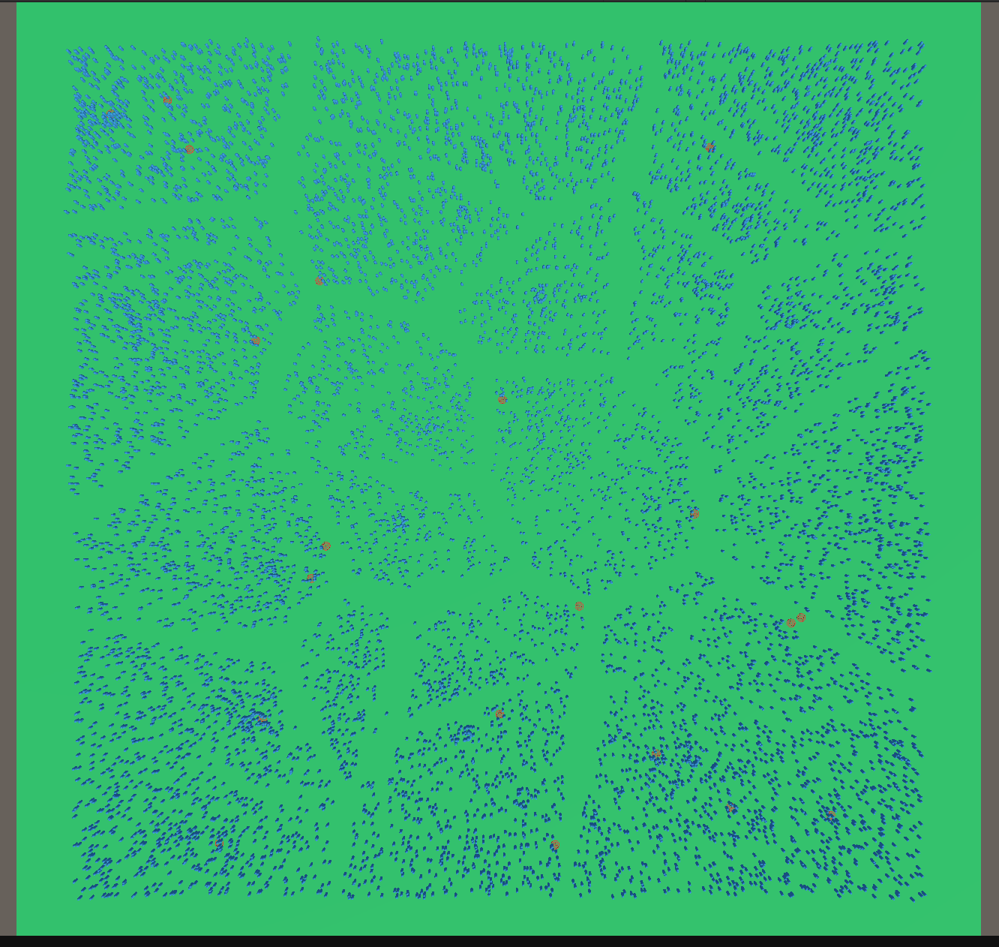

# LEARN DOTS - Performance Tests

As a beginner with Unity  Data-Oriented Technology Stack (DOTS), I wanted to do some performance tests to compare MonoBehaviours and Entites.

;

### Situation
The scene has 10 000 objects which are seekers. Seekers look for the closest target and move toward it. There are 20 targets per scene.
They look for the closest target each frame because targets can by moved at any time when a user presses space key.
I didn't implement optimizations (such as only updating the closest target when targets are moved) because most optimizations can be implemented either with MonoBehaviours or Entities.

### Solution 1 : Individual MonoBehaviour
I started with the worst implementation : each seeker as a ```TargetSeeker``` script (```MonoBehavior```).

### Solution 2 : Manager MonoBehaviour
This solution keeps using traditional monobehaviours but only one : a global manager which iterates over seekers and targets.

### Solution 3 : Jobified Manager MonoBehaviour
My global manager iterates now on seekers on multi threads thanks to [```IJobParallelForTransform```](https://docs.unity3d.com/ScriptReference/Jobs.IJobParallelForTransform.html). I also added Burst Compiler for this solution

### Solution 4 : Simple ECS
I totally switched from MonoBehaviours to Entities for this example.

### Solution 5 : Simple Burst ECS
Same as solution 4 but with Burst Compiler.

### Solution 6 : ECS + Job
Now my Move Seeker System uses jobs to multithread computations.

### Solution 7 : ECS + Job + Burts (Full DOTS stack)
Same as solution 6 but with Burst Compiler.

### Test conditions

Computer :
- AMD Ryzen 7 7700, AMD RX 7800 XT, 32 GO DDR5 (6000MHz), MSI B650 Gaming Plus Wifi

Resolution : 1255px x 613 px

Unity and package versions :
- Unity 6 (6000.0.10f1)
- Burst 1.8.16
- Collections 2.4.2
- Entities 1.2.3
- Entities Graphics 1.2.3
- URP 17.0.3


### Results

Results are very different from different solutions, so my numbers are not very accurate, I just picked some "normal" frames from the Profiler and made an average.

|             |  Moving Seeker Time (ms) | Player Loop (ms) | Gain over solution 2 | Rendering Time (ms) | Average FPS   |
| :---        |    :----:                |    :----:        |    :----:            |    :----:           |        :----: |
| Solution 1  |  18.5                    | 18.5             | -76%                 | 7                   | 41            |
| Solution 2  |  9.6                     | 10.5             | 0                    | 7                   | 55            |
| Solution 3  |  0.682                   | 1.83             | 82%                  | 7                   | 118           |
| Solution 4  |  7.5                     | 8                | 24%                  | 1.7                 | 100           |
| Solution 5  |  1.1                     | 1.5              | 86%                  | 1.7                 | 340           |
| Solution 6  |  0.44                    | 0.8              | 92%                  | 1.7                 | 420           |
| Solution 7  |  0.032                   | 0.5              | 85%                  | 1.7                 | 480           |

Rendering times and average fps are just here to show it seems objects are rendered much faster with Entities Graphics but this needs to be detailed to be sure. Here what really matters is comparing Moving Seeker times.